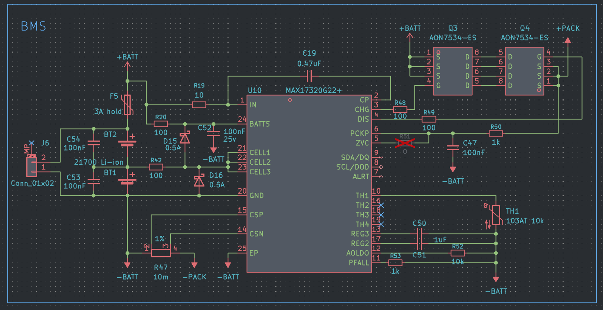
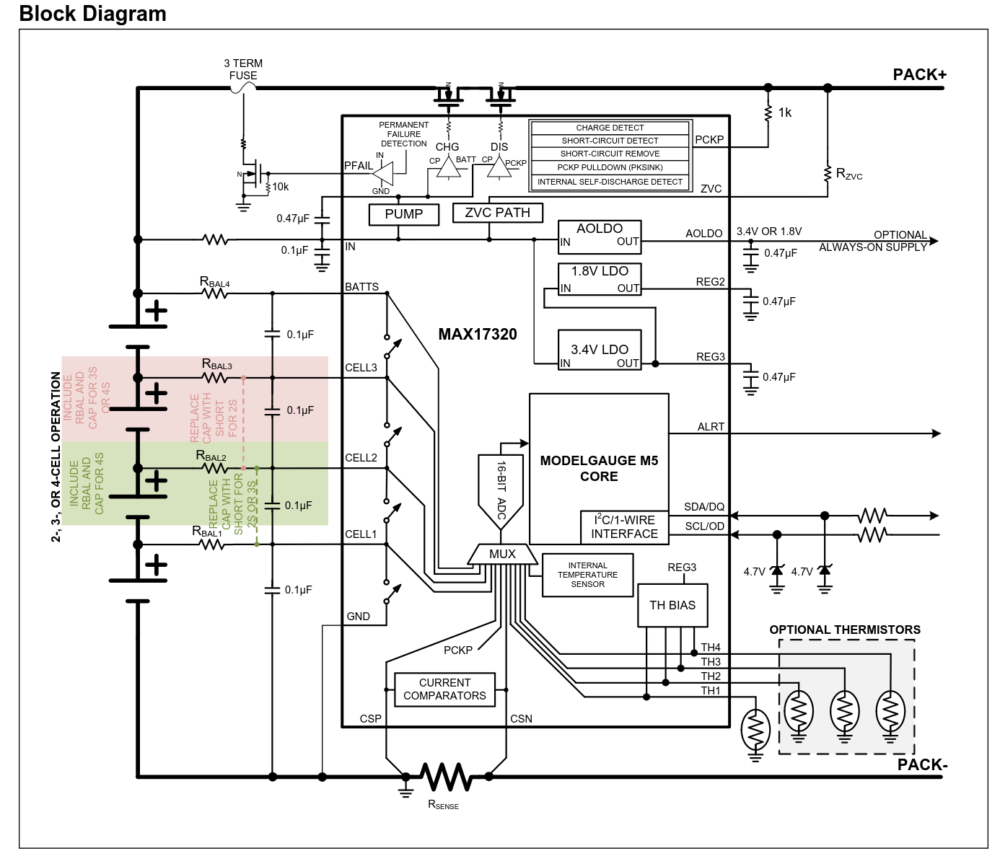

## Starting the journal - 4 hours (2026-08-07)

I thought I should probably get into some more Hack Club stuff, and add more documentation for what I'm doing so I don't forget. I'm in the process of revamping the circuit protection. For the amount of money these modules and ICs cost (~$50 CAD), I think it's wise to throw at least $5 in circuit protection components at it. Of course the best circuit protection is just being careful and taking the proper precautions, but I'm a little silly.

I've already protected the RF frontends of the LoRa and GNSS modules, with ESD diodes and current limiting, so I'm moving on to the power inputs. I'm looking at implementing the `TI TPS25947` family of eFuses, specifically the [TPS259470LRPWR](https://www.ti.com/product/TPS25947/part-details/TPS259470LRPWR), which Claude suggested. This eFuse has both an overvoltage protection feature and an overcurrent protection feature. In my GNSS module's datasheet, the NEO-M9N has a maximum power supply voltage of 3.6 V. I can then set the eFuse's OVLO (overvoltage lockout) to cut off power when the input voltage exceeds 3.55 V, just below the NEO's maximum. However, there is one issue with this. In order for the eFuse to recover and continue operation after a fault state, the 3V3 input power rail must fall below 3.25 V, which would never happen in regular use. But that would just mean I have to power off the device and turn it on again, which isn't that bad considering it protected my expensive module from frying.

Considering maybe adding a cheap 50-cent TVS diode to the TPS259470LRPWR input, as the datasheet says it may be helpful. I'll have to see.

## Finalizing circuit protection - 2 hours (2026-08-08)

* Switched from the `TPS259470LRPWR` to the `TPS259474LRPWR` for slightly better OVLO tolerances (5.5% to 1.7%), allowing the trip voltage to be more precise.
* Added a rechargeable battery to V_BCKP on U2.
* Decided on using the `TPS259474ARPWR` for the future buck converter output.

## Research BMS and charge controller choices - 2 hours (2026-08-09)

I think I've settled on using the `MAX17320Gxx`. I was thinking of initially going with the `BQ40Z50`, but with that one you are forced to use some of TI's software and buy their testing equipment in order to program it. The MAX17320 is only a little more and has a whole host of nice-to-have features like cycle count and intelligent algorithms to calculate percentage. It is however quite expensive at $8 CAD per IC, but I think it's worth the safety and ease of use aspects. I watched [this YouTuber](https://www.youtube.com/watch?v=UUr-CJudg38) on how he designed his BMS, it was quite insightful.

### Charge Controller Selection

As for the charge controller, I went with the [BQ25798](https://www.ti.com/product/BQ25798). It's relatively cheap at $3 CAD each, it's modern and a recent design, and highly efficient. It supports a wide range of input voltages (USB-C PD fast-charging!) and can even communicate with the microcontroller to set custom charge limits to preserve battery health. However, it's a little noisy with its four switching MOSFETs, so it's going to take some consideration in layout so as not to interrupt any data lines and RF components/traces.

My goal was to get a slightly more premium BMS that had some of the nice features you'd see in mobile phones.

## Wiring up the BMS - 3 hours (2026-08-10)

| my design | reference design |
| :---: | :---: |
|  |  |

I'm sure there are still some issues or things to double check, but it's a good start. I studied the example block diagram schematic from the datasheet, and a few other schematics I could find when googling "MAX17320G22+ kicad schematic". Claude said the `AON7534` N-channel MOSFET would be best, so I trusted it. I'm trying to think about how I'll have the thermistor placed, because I'm using two 21700 battery holders next to each other. Perhaps I could expose some copper and use one of those SMD NTC thermistors? The batteries would then be sitting very close to the thermistor, and perhaps I could add some type of thermally conductive but not electrically conductive material or foam. I don't like the idea of taping the thermistor to the batteries...

## Confirming BMS wiring, adding testpoints and voltage/power ratings to components - 3 hours (2026-08-13)

Spent some time today double-checking the wiring on the BMS and learning more about it from the datasheet. I'm much more confident in my wiring now, and I added some DNP components in case I need to swap anything or make changes to it afterwards, plus testpoints as well. Most of the capacitors I was planning on using are well below the voltage rating they should be for the BMS, so I made sure to explicitly mention capacitor voltage ratings in the part field in KiCad.

Next steps would be to make the `MAX17320G22+` symbol a little prettier and organize my wiring, and to wire the charge controller. It's a little hard to read in its current state. So many components on such a small symbol. Maybe I'll ask in the KiCad Discord for suggestions on how to make the BMS schematic a little clearer.

## Wiring up the charge controller & selecting buck converter and PD IC - 4 hours (2026-08-14)

Following the reference application schematic for the [BQ25798](https://www.ti.com/product/BQ25798) and calculated the inductor current for my application. Reading over the data, it's actually a pretty impressive piece of silicon for how many features it has in such a small package. It uses narrow voltage DC (NVDC), so it'll take power directly from your USB-C circuitry, regulate it within a certain range similar to your battery, and then you can power your buck converter and downstream devices from its `SYS` output at up to 6 A. No external power muxing needed, and it's really efficient. Battery charge current can be set fixed, or dynamically through its I2C bus. The downside is the high frequency switching (750 kHz - 1.5 MHz), but I think if I physically keep it distanced far enough away from the RF components, and choose a good inductor, I should be okay.

One thing I tried to keep in mind for the charge controller and BMS circuitry: even though I'm only planning on having two series batteries, I should try to make most of the components compatible with the maximum 4S that both ICs support. This means having all the components rated for `>25V`, so choosing capacitors that are rated for 50 V. In turn this would mean having to add more capacitors than I normally would, in order to satisfy capacitor DC bias derating at higher voltages.

*I do need to clean this up and make it look less muddled...*

For the USB-PD, I wanted to choose something cheap, easy and small. I have no need for extra features or for it to support a wide range of USB chargers. I went with the [HUSB238](https://en.hynetek.com/2421.html), specifically the `HUSB238_002DD`. It's about $0.70 CAD each on LCSC, and supports a fixed 9 V USB trigger. The more common option would be to use the `CH224K`, but it had a large package and looked "old", although it's cheaper.

Lastly, I need a 5 V rail to run off the outputted `SYS` from the charge controller, so approximately a `5V - 8.8V` input. Claude helped me choose the `LM61460-Q1`, specifically the [LM61460AASQRJRRQ1](https://www.ti.com/product/LM61460-Q1/part-details/LM61460AASQRJRRQ1). It's a little steep at $2 CAD on [LCSC](https://www.lcsc.com/product-detail/C1855832.html), but using TI components is nice, and this IC is ideal for powering sensitive high-frequency components (it has "Low EMI" in the title). One of the ways it achieves this low EMI is by letting you customize its switching frequency, thereby sacrificing efficiency for switching at a frequency that doesn't interfere with frequencies elsewhere on the board.

> The switching frequency can be set or synchronized between 200 kHz and 2.2 MHz to avoid noise sensitive frequency bands.
